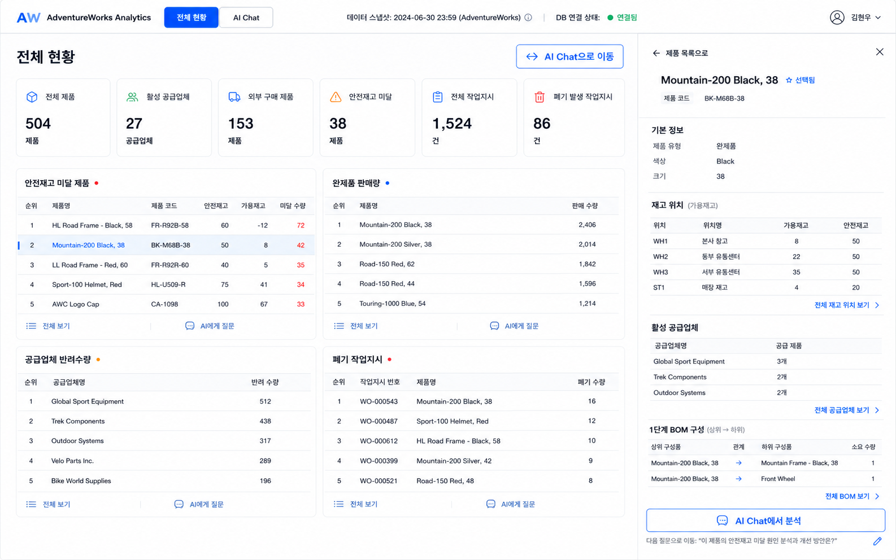

# 전체 현황 대시보드 디자인 기준

## 기준 이미지

이 이미지는 `/dashboard`의 1440×900 기준 화면, 6개 KPI 배치, 2열 분석 카드,
480px 엔티티 상세 패널의 시각 기준이다. 실제 구현은 이미지에 보이는 구성 중
검증된 PostgreSQL·Neo4j 필드만 사용한다.

## 마이그레이션 원칙

- 기존 `index.css`의 색상 토큰, Pretendard, 다크모드와 노드 색상을 유지한다.
- 기존 `Button`, `Badge`, `TopBar`를 확장해 `/dashboard`와 `/chat`이 같은 제품으로 보이게 한다.
- 기존 Chat의 질문, 결과, 이력, SQL·Cypher 패널과 Sigma 동작은 유지한다.
- 로그인 뒤 첫 화면만 `/dashboard`로 바꾸고 Chat은 `/chat`로 이동한다.
- 카드 목록과 엔티티 정보는 신규 고정 API로만 불러온다.

## 화면 토큰

- 배경: 기존 `bg-bg`
- 표면: 기존 `bg-panel`
- 보조 표면: 기존 `bg-panel-2`
- 기본 강조색: 기존 `text-info` / `bg-primary`
- 상태색: `success`, `warn`, `fail`
- 카드: 1px `border-border`, 10~12px 반경, 매우 약한 그림자
- 데스크톱 거터: 32px, 모바일 거터: 16px
- KPI: XL 6열, LG 3열, SM 2열, 모바일 1열
- 분석 카드: XL 2열, 그 이하 1열
- 상세 패널: 데스크톱 480px, 좁은 화면 전체 폭

## 데이터 정합성 예외

콘셉트 생성 과정에서 제거한 미검증 항목은 다음과 같다.

- 매출액·판매이익
- 반려율·반려금액
- 공급업체 리드타임·최근 납기
- 제품 이미지
- 실시간·오늘·지연·현재 생산 중 상태

위 항목은 스키마 확장과 데이터 계약 검증 전까지 화면에 추가하지 않는다.
