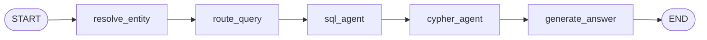

# T2C 오케스트레이션 스켈레톤 구성

## 개요

본 문서는 자연어 질문을 확정된 Entity로 매핑하고, SQL·GRAPH Route로 분기해 Query 생성·실행까지 이어지는 Orchestrator Graph의 최초 Skeleton 구성을 설명한다.

State 정의는 `backend/orchestrator/state.py`의 `OrchestratorState`에서 관리한다. Orchestrator는 Manifest 대신 LangGraph의 `StateGraph`로 Node 순서를 관리하며, 각 Node는 공유 State 중 자신이 맡은 필드만 갱신해 다음 Node로 전달한다.



Graph는 조건부 Edge(Branch) 없이 5개 Node를 순서대로 실행하는 단일 경로다. Route 분기는 Graph 구조가 아니라 `sql_agent`/`cypher_agent` Node 내부에서, 자신의 Tool(`sql`/`graph`)이 `tool_plan`에 없으면 실행을 건너뛰고 즉시 반환하는 방식으로 처리한다.

이 Skeleton은 Node 각각의 최종 로직이 아니라, State가 Node 사이를 올바른 순서로 통과하는지를 우선 검증하는 것을 목표로 한다. Query 실행 함수, 실패 시 재시도, 위험 Query 차단, 최종 응답 생성은 이번 범위에 포함하지 않고 자리(Stub)만 만들어 다음 구현자에게 넘긴다. 원 설계 근거는 [ADR 0008](adr/0008-t2c-easy-query-routing-skeleton.md)을 따른다.

## 1. 구현 범위

> Entity 확정부터 Route 결정, Query 생성·실행 골격까지 이어지는 End-to-End 실행 가능한 Skeleton Graph를 제공한다.

- 이 Skeleton은 다음 기능을 담당한다.
    - 자연어 질문에서 Entity 이름 추출 및 DB 확정(EXACT 매칭)
    - EXACT 매칭 실패 시 유사도 기반 후보 조회 및 사용자 확인 Error
    - 사용자가 확인한 Entity로 재진입하는 흐름(`confirmed_entity`)
    - Entity 종류를 코드에 나열하지 않고 Graph Schema에서 동적으로 도출
    - SQL·GRAPH·HYBRID Route(Tool Plan) 결정
    - SQL/Cypher Query 생성 및 1회 실행 시도 SubGraph 골격
    - `OrchestratorState`, `AppError` 계층 정의
    - 5개 Node를 Edge로 연결한 End-to-End Graph 배선 및 조립 검증
- 다음 기능은 이번 Skeleton 범위에 포함하지 않는다.
    - `execute_sql`/`execute_cypher`의 실제 DB 실행 구현
    - 실행 실패 시 재시도(Self-Correction) 로직
    - Query 안전 검사(쓰기 문법·미허가 테이블 차단 등 Guard)
    - 여러 단계로 나뉜 복합 질의 실행 계획(Subquery 의존성·입력 Binding)
    - 최종 자연어 응답 생성(LLM 호출)
    - Graph 전체의 비동기(Async) 전환

현재 Skeleton은 자연어 질문부터 Query 생성·1회 실행 시도까지의 흐름을 대상으로 하며, 실행 결과의 정답 여부는 검증하지 않는다.

## 2. 파이프라인 구성

| Node | 역할 | Skeleton 시점 특징 |
| --- | --- | --- |
| `resolve_entity` | 질문에서 대상 이름을 추출해 DB에서 Entity로 확정 | EXACT·유사도 매칭, 다중 Entity 추출, 모호 Entity 재확인 흐름까지 구현 |
| `route_query` | 확정된 Entity를 참고해 SQL·GRAPH·HYBRID Route(Tool Plan) 결정 | Tool Plan 배열만 반환(Subquery 실행 계획 없음) |
| `sql_agent` | SQL Query 생성 및 실행 시도 | 생성 1회 + 실행 1회, 재시도 없음, 실행 함수는 Stub |
| `cypher_agent` | Cypher Query 생성 및 실행 시도 | 생성 1회 + 실행 1회, 재시도 없음, 실행 함수는 Stub |
| `generate_answer` | 실행 결과를 최종 응답으로 조합 | LLM 호출 없는 Pass-through Stub |

### 2.1 Entity 확정 — `resolve_entity`

> 질문에 등장하는 대상 이름을 종류 구분 없이 추출해 DB 행으로 확정한다.

Entity 종류(Product/Supplier/Category 등)는 코드에 나열하지 않고 `graph_schema.yaml`의 `name` 속성을 가진 Node 정의에서 동적으로 도출한다(`entity_types.py`). EXACT 매칭이 실패하면 PostgreSQL `pg_trgm` 확장으로 유사 후보를 조회하고, 후보가 있으면 `EntityAmbiguousError`(§4.2)로 사용자 확인을 요구한다. 사용자가 후보를 확정해 `confirmed_entity`로 재요청하면, 그 값을 DB 존재 여부로 재검증한 뒤 신뢰하고 나머지 미확정 Entity만 다시 추출한다.

### 2.2 Route 결정 — `route_query`

> 확정된 Entity와 질문 원문을 함께 LLM에 전달해 사용할 Tool을 결정한다.

SQL 사용 조건(수치 조회·집계)과 GRAPH 사용 조건(다단계 관계 탐색)을 Few-shot 예시 3개로 제시하고, LLM 응답을 JSON 배열(`tool_plan`)로 파싱한다. 빈 배열이거나 지원하지 않는 Tool 이름이 섞여 있으면 `ValueError`로 즉시 실패시킨다. HYBRID(`["sql", "graph"]`)는 Few-shot 예시에 존재하지만 Skeleton 시점에는 별도 실행 계획 없이 두 Tool을 순서대로 실행하는 것으로만 처리한다.

### 2.3 Query 생성·실행 골격 — `sql_agent` / `cypher_agent`

> Query 생성과 실행을 SubGraph(Graph 안에 포함되는 독립된 작은 Graph)로 분리하되, 재시도 없이 1회씩만 시도한다.

두 SubGraph는 대칭 구조다. `agent` Node가 LLM으로 Query 문자열을 생성하고, `tools` Node가 그 Query를 실행 함수(`execute_sql`/`execute_cypher`)에 넘겨 실행을 시도한 뒤 곧바로 종료한다. 실행 함수는 매개변수로 주입받는 형태로 설계했고, Skeleton 시점에는 아래처럼 항상 실패하는 자리표시자(Stub)를 넣어뒀다.

```python
def _execute_sql_stub(sql: str) -> Any:
    raise NotImplementedError("SQL 실행/검증은 self-correction 구현에서 채운다.")
```

### 2.4 응답 조합 — `generate_answer`

> SQL·GRAPH 실행 결과를 최종 응답 문자열로 합친다.

LLM을 호출하지 않고 `sql_result`/`graph_result`를 문자열로 이어붙이는 Pass-through Node다. 자연어 응답 생성 로직은 이번 범위에 포함하지 않는다.

## 3. 패키지 구조

Skeleton을 넘긴 시점(2026-08-25) 기준 구조는 다음과 같다.

```
text2cypher-manufacturing/
├── backend/
│   ├── orchestrator/
│   │   ├── entity_types.py
│   │   ├── errors.py
│   │   ├── graph.py
│   │   ├── state.py
│   │   ├── nodes/
│   │   │   ├── resolve_entity.py
│   │   │   ├── route_query.py
│   │   │   └── generate_answer.py
│   │   └── subgraphs/
│   │       ├── sql_agent.py
│   │       └── cypher_agent.py
│   └── tests/
│       └── orchestrator/
└── schema/
    ├── sql_schema.yaml
    └── graph_schema.yaml
```

### 3.1 `backend/orchestrator`

> State·Error 정의, Node 구현, Graph 조립을 담당한다.

- `state.py`: Orchestrator 전체가 공유하는 State(`OrchestratorState`)를 정의한다.
- `errors.py`: API 응답으로 나가는 도메인 Error 계층(`AppError`)을 정의한다.
- `entity_types.py`: 이름으로 조회 가능한 Entity 종류를 Graph Schema에서 동적으로 도출한다.
- `graph.py`: 5개 Node를 Edge로 연결해 컴파일된 Graph를 반환한다(`build_orchestrator_graph`).
- `nodes/resolve_entity.py`: 질문에서 Entity 이름을 추출하고 DB에서 확정한다.
- `nodes/route_query.py`: 확정된 Entity를 참고해 Tool Plan을 결정한다.
- `nodes/generate_answer.py`: SQL·GRAPH 결과를 최종 응답 문자열로 조합한다.
- `subgraphs/sql_agent.py`: SQL Query를 생성하고 1회 실행을 시도하는 SubGraph.
- `subgraphs/cypher_agent.py`: Cypher Query를 생성하고 1회 실행을 시도하는 SubGraph.

## 4. State 및 Error 계약

### 4.1 `OrchestratorState`

`query`만 필수이고 나머지는 Graph 실행 중 각 Node가 채워나가므로, 파이썬 `TypedDict`의 `NotRequired`(지금 없어도 되고 나중에 채워져도 되는 필드 지정자)로 선언한다.

| 필드 | 채우는 Node | 값의 의미 |
| --- | --- | --- |
| `query` | (입력) | 사용자 자연어 질문 원문(필수) |
| `entity` | `resolve_entity` | 확정된 Entity(예: `{"productId": 680}`) |
| `confirmed_entity` | (입력, 선택) | `EntityAmbiguousError` 이후 사용자가 확인한 Entity |
| `tool_plan` | `route_query` | 사용할 Tool 목록(`["sql"]` / `["graph"]` / `["sql","graph"]`) |
| `sql_query` / `cypher_query` | `sql_agent` / `cypher_agent` | 생성된 Query 문자열 |
| `sql_result` / `graph_result` | `sql_agent` / `cypher_agent` | 실행 결과와 Error 정보 |
| `final_answer` | `generate_answer` | 최종 응답 문자열 |
| `error` | (예약) | Orchestrator 레벨 Error 메시지 — 이번 범위에서 채워지는 경로 없음 |

### 4.2 `AppError` 계층

API 응답으로 나가는 도메인 Error(프로그램 버그가 아니라 예상된 실패 상황)는 모두 공통 부모 클래스 `AppError`(HTTP 상태 코드, Error 코드, 메시지를 함께 담음)를 상속한다.

| 클래스 | HTTP 상태 코드 | 발생 조건 | Skeleton 시점 실제 발생 여부 |
| --- | --- | --- | --- |
| `EntityNotFoundError` | 404 | 이름으로 찾는 Entity가 EXACT·유사도 매칭 모두 실패 | 예 |
| `EntityAmbiguousError` | 200 | 유사 후보가 여러 개라 사용자 확인이 필요할 때, 후보 목록(`candidates`) 포함 | 예 |
| `RetryExceededError` | 422 | 재시도 횟수를 모두 소진했을 때 | 아니오 — Self-Correction 루프 자체가 이번 범위에 없어 클래스만 정의 |

## 5. 처리 흐름

### 5.1 `resolve_entity` 처리 순서

1. `confirmed_entity`가 있으면 DB 존재 여부로 재검증한다.
2. LLM Function Calling(정해진 형식의 함수 호출로 원하는 정보만 뽑아내는 방식)으로 질문에서 이름과 종류를 추출한다. 이름이 여러 개면 모두 추출한다.
3. 각 이름을 EXACT 매칭으로 조회한다.
4. 실패한 이름은 `pg_trgm` 유사도 검색으로 후보를 조회한다.
5. 후보가 없으면 `EntityNotFoundError`를 발생시킨다.
6. 후보가 있으면 `EntityAmbiguousError`를 발생시켜 사용자 확인을 요청한다.
7. 확정된 Entity 개수에 따라 `entity` 필드를 `None`/`dict`/`list[dict]` 형태로 반환한다.

### 5.2 `route_query` 처리 순서

1. `query`와 `entity`를 Few-shot Prompt 입력 형식으로 구성한다.
2. LLM을 호출해 Tool 이름의 JSON 배열 응답을 받는다.
3. 배열이 비어 있거나 지원하지 않는 Tool 이름이 있으면 `ValueError`를 발생시킨다.
4. 검증을 통과한 배열을 `tool_plan`으로 반환한다.

### 5.3 `sql_agent` / `cypher_agent` Skeleton 구조

```
SubGraph START
    ↓
agent  (Query 1회 생성)
    ↓
tools  (실행 1회 시도)
    ↓
SubGraph END (재시도 없음)
```

- `tools` Node는 실행 함수 호출을 `try/except Exception`으로만 감싼다. 예외 종류를 구분하지 않고 모두 `error` 필드에 문자열로 담아 그대로 종료한다.
- 실행 결과가 성공이든 실패든 조건부 Edge 없이 곧바로 SubGraph를 끝낸다 — 실패해도 다시 시도하는 분기 자체가 없다.
- 상위 Graph의 `sql_agent`/`cypher_agent` Node는 자신의 Tool이 `tool_plan`에 없으면 SubGraph를 호출하지 않고 `{"sql_query": None, "sql_result": None}` 형태로 즉시 반환한다.

### 5.4 `generate_answer` 처리

`sql_result`/`graph_result`가 있으면 각각 `"SQL: {...}"`, `"GRAPH: {...}"` 형태의 문자열로 만들어 `" / "`로 이어붙인다. 둘 다 없으면 `None`을 반환한다. LLM 호출은 없다.

## 6. Skeleton 경계 규칙

> 미구현 부분(Stub)이 다음 구현자에게 안전하게 전달되도록 지키는 규칙이다.

- 미구현 함수는 항상 명시적 예외(`NotImplementedError`)를 던진다. 값을 조용히 비워 반환하지 않는다.
- SubGraph의 State Shape(`query`/`entity`/`schema`/`messages`/`result`/`error`)은 이후 재시도 로직이 필드만 확장해 이어받을 수 있도록 먼저 고정한다.
- 각 Node는 자신이 처리하지 않는 Tool 조건에서 즉시 반환하고, 다음 Node 실행을 막지 않는다.
- Graph 조립·SubGraph 실행 실패는 항상 로그로 남긴다 — 배선 과정에서 실행 실패가 로깅 없이 삼켜지는 문제가 실제로 발견되어 수정됐다.
- 각 Stub 함수의 예외 메시지·Docstring에 다음 구현자가 채워야 할 범위를 명시한다(예: "SQL 실행/검증은 self-correction 구현에서 채운다").

## 7. 검증 방법

Skeleton 시점에는 HTTP 엔드포인트(`/chat`)를 통한 검증 대신, 컴파일된 Graph(`build_orchestrator_graph`)를 테스트에서 직접 호출해 검증한다.

```bash
cd backend
venv/Scripts/python -m pytest tests/orchestrator -v
```

- `test_resolve_entity.py`: EXACT·유사도 매칭, 모호 Entity 재확인 흐름 검증
- `test_route_query.py`: Tool Plan 파싱·검증 규칙 검증
- `test_sql_agent.py` / `test_cypher_agent.py`: 생성-실행 SubGraph 골격 검증
- `test_graph.py` / `test_graph_integration.py`: 5개 Node 배선과 End-to-End 실행 검증

## 8. 인계 시점 상태 및 알려진 제약

아래 항목은 Skeleton 시점에 자리만 만들어 넘긴 부분과, 실제 구현이 이어진 시점을 정리한 것이다.

| 항목 | Skeleton 시점 상태 | 실제 구현 |
| --- | --- | --- |
| `execute_sql` / `execute_cypher` | `NotImplementedError` Stub | 2026-08-27, DB 실행부로 교체 |
| Self-Correction 재시도 루프 | 없음(1회 생성·1회 실행) | 2026-08-25 12:22~, 재시도 State Machine 배선 |
| SQL/Cypher Query 안전 검사(Guard) | 없음 | 2026-08-27, 쓰기 문법·미허가 테이블 차단 Guard 추가 |
| 복합 질의 `subqueries` 실행 계획 | `route_query`가 `tool_plan`만 반환 | 2026-08-26, `dependsOn`/`inputBindings`/`joinKeys` 기반 실행 계획 추가 |
| `generate_answer` 실제 응답 생성 | Pass-through Stub | 미구현(문서 작성 시점 기준 팀 전체 범위에서도 남은 항목) |

알려진 제약:

- `route_query`가 단일 `tool_plan` 배열만 반환하는 구조로 넘겨져, 이후 단계 간 의존 관계를 표현해야 하는 복합 질의를 지원하려면 응답 스키마 자체를 다시 설계해야 했다.
- `confirmed_entity`를 단일 `dict`로만 가정하고 설계해, 한 질문에 모호한 이름이 2개 이상인 경우 이전 확정이 덮어써지는 문제가 이후 별도로 발견·수정됐다(2026-08-27).
