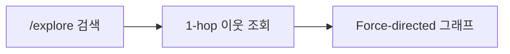

# 그래프 이웃 탐색기 UI 계획

## 개요

본 문서는 사용자가 이름으로 아무 노드나 검색해 그 노드의 실제 Neo4j 이웃을 자유롭게 둘러보는 별도 화면(`/explore`)의 계획을 설명한다. 설계는 브레인스토밍으로 확정했고([스펙 문서](superpowers/specs/2026-08-27-graph-neighbor-explorer-design.md)), 구현은 아직 시작하지 않았다.

## 1. 왜 필요한가

지금 `/chat`은 질문에 대한 답(SQL/Cypher 실행 결과)만 보여줄 뿐, Neo4j에 실제로 어떤 데이터가 얼마나 연결돼 있는지 사용자가 직접 둘러볼 화면이 없다. 프론트에 `PathGraphCanvas`라는 컴포넌트가 이미 있지만 "연동 예정" 문구만 있고 실제로는 어디에도 렌더링되지 않는 죽은 코드다 — "Neo4j가 실제로 연결됐다는 걸 눈으로 확인하고 싶다"는 요구를 이 죽은 자리 대신 새로 채우기로 했다.

## 2. 무엇을 배치할 것인가

- 새 라우트 `/explore`, `TopBar`에 진입 버튼(로그인 후에만 노출).
- 검색창 + 자동완성 드롭다운 — 입력하면 디바운스 후 후보를 타입 뱃지와 함께 보여준다.
- 캔버스에 중심 노드(강조 스타일) + 1-hop 이웃 노드 + 관계 라벨이 달린 화살표를 렌더링. 확대·축소·화면 맞춤 컨트롤 포함.
- 관계 타입별로 "총 N건 중 상위 M건 표시" 텍스트를 캔버스 옆에 나열.
- 노드를 클릭하면 우측 패널에 그 노드의 실제 속성을 표시.

## 3. 어떤 방법을 쓸 것인가, 그리고 왜

각 결정은 범위를 좁혀온 과정에서 나왔다 — 처음엔 스키마 구조도(실제 데이터가 아니라서 기각), 그다음엔 전체 데이터 로드(`WorkOrder` 약 72,000건 등 규모가 안 맞아 기각)를 검토했고, 최종적으로 "검색 → 1-hop 이웃만 조회"로 좁혔다.

| 결정 | 방법 | 이유 |
| --- | --- | --- |
| 조회 범위 | 검색한 노드의 1-hop 이웃만 | 스키마 전체·다중 홉은 노드 수가 너무 많아 화면에 담을 수 없다 |
| 이웃 초과분 처리 | 관계 타입별 상한(`LIMIT`) + 실제 총 개수 표시 | 무제한 스크롤 리스트보다 최소 구현으로 먼저 만들어보고 필요성을 판단하기 위해 |
| 그래프 Layout | `react-force-graph-2d`(Force-directed) | 이웃 데이터는 트리가 아니라 노드 수·연결 형태가 매번 달라지는 임의 그래프라 고정 배치를 쓸 수 없다 |
| 이름 검색 로직 | `resolve_entity.py`의 EXACT+`pg_trgm` 유사도 로직을 `entity_search.py`로 추출해 재사용 | 이미 검증된 검색 로직을 중복 구현하지 않기 위해 |
| 관계 순회 방식 | `graph_schema.yaml`의 `relationships` 정의를 그대로 순회 | 새 관계 타입이 추가돼도 코드 변경 없이 반영되도록 — `resolve_entity` 일반화 때 채택한 "스키마 기반 동적 조립" 원칙을 그대로 따른다 |

## 4. 백엔드에서 먼저 준비할 것

| 엔드포인트 | 역할 |
| --- | --- |
| `GET /graph/search?q=<text>` | 이름 검색 가능한 전체 Entity 타입을 대상으로 EXACT 매칭 후 유사도 검색, 후보 목록 반환 |
| `GET /graph/{entityType}/{id}/neighbors` | 중심 노드의 1-hop 이웃을 관계 타입별로 조회, 상한과 실제 총 개수를 함께 반환 |

`GET /graph/{entityType}/{id}/neighbors`는 이 프로젝트에서 실제로 Cypher를 실행하는 첫 코드가 된다 — Self-Correction 쪽의 `execute_cypher`([오케스트레이션 스켈레톤 문서](t2c-orchestrator-implementation.md) 참고)는 LLM이 자유롭게 생성한 Query를 검증·재시도하는 별개의 관심사라 코드를 공유하지 않는다.

## 5. 구현 순서

1. `resolve_entity.py`의 검색 로직을 `entity_search.py`로 추출한다 — 기존 `test_resolve_entity.py`가 그대로 통과해야 하는 순수 리팩터링이다.
2. `GET /graph/search`, `GET /graph/{entityType}/{id}/neighbors`를 구현하고 Neo4j 드라이버를 Mock한 테스트를 추가한다.
3. 프론트에 `lib/graph.ts`(API 호출)와 `/explore` 라우트, 검색 UI, `react-force-graph-2d` 캔버스를 구현한다.
4. 자동 렌더링 테스트는 만들지 않는다 — 프론트에 아직 컴포넌트 렌더링 테스트 관행이 정착되지 않아 `tsc -b`/`eslint` 통과와 수동 클릭 확인으로 대체한다.

## 6. 아직 확실하지 않은 점

- 이웃 노드를 클릭해 계속 확장하는 멀티홉 탐색은 이번 계획에 포함하지 않는다 — 필요성이 확인되면 별도로 설계한다.
- 상한을 넘는 이웃을 스크롤 리스트 등으로 추가로 보여줄지는, 이번 최소 구현("총 N건 중 상위 M건" 표시)을 써본 뒤 판단한다.
- `react-force-graph-2d`의 실제 렌더링 성능(이웃이 상한 근처로 꽉 찼을 때)은 구현 후 실측이 필요하다.
